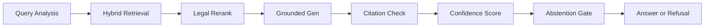

# 🏛️ IP-SAKTI Sahayak

<div align="center">


**Intellectual Property Intelligence Engine**

*A three-layer cognitive architecture that reads the law, remembers every clause, speaks it back with citations, and knows when to stay silent.*

[🚀 Quick Start](#-quick-start) • [📖 Documentation](#-documentation) • [🏗️ Architecture](#-architecture) • [🎯 Features](#-features) • [📊 Metrics](#-metrics)

</div>

---

## 🌟 Overview

**IP-SAKTI Sahayak** is not just a chatbot — it's a **Legal Intelligence Engine** built specifically for Indian Intellectual Property law. 

It doesn't guess. It:
- ✅ **Retrieves** verified statutes from 25 canonical documents
- ✅ **Reranks** evidence using 9 legal-feature signals
- ✅ **Grounds** every answer in authoritative sources
- ✅ **Validates** citations against evidence chunks
- ✅ **Abstains** when corpus is silent or evidence is insufficient
- ✅ **Speaks** in 34+ languages with voice intelligence

### 📈 Runtime Performance (September 2026)

| Metric | Score | Description |
|--------|-------|-------------|
| **Runtime Eval Pass** | `55/55` | All test questions answered correctly |
| **MRR Score** | `0.97` | Mean Reciprocal Rank for retrieval quality |
| **Citation Integrity** | `1.00` | Zero hallucinated citations |
| **Abstention Accuracy** | `1.00` | Perfect refusal on out-of-scope queries |
| **Corpus Size** | `7,019 chunks` | From 25 verified documents |
| **Confidence Formula** | `6-factor` | Evidence count, citation density, reranker score, validity, source status, domain match |

---

## 🏗️ Architecture

### Three Layers. One Mind.

```
┌─────────────────────────────────────────────────────────────────┐
│                         USER INTERFACE                          │
│  React 19 + TypeScript • Voice Chat • Evidence Cards • Routing │
└────────────────────────┬────────────────────────────────────────┘
                         │
                         ▼
┌─────────────────────────────────────────────────────────────────┐
│                      ORCHESTRATION LAYER                        │
│  Spring Boot 4.1.1 + Java 25 • JWT Auth • Query Routing       │
│  Gemini Translation • Conversation State • RAG Protocol        │
└────────────────────────┬────────────────────────────────────────┘
                         │
                         ▼
┌─────────────────────────────────────────────────────────────────┐
│                         RAG BRAIN                               │
│  FastAPI + Python 3.12 • Hybrid Retrieval • Legal Reranker    │
│  Grounded Generation • Citation Validation • Guardrails        │
└─────────────────────────────────────────────────────────────────┘
```

### 🎨 Frontend — The Interface
**Stack:** React 19 • TypeScript 5.9 • Vite 7 • React Router 7

**Core Features:**
- 🎤 **Voice Assistant** — STT/TTS with live audio visualization
- 💬 **Conversation Memory** — Persistent chat history with evidence cards
- 🧪 **Formulation Analysis** — Ayurveda product readiness assessments
- 📋 **Regulatory Tracking** — Real-time monitoring of IP regulations
- 🌐 **Multilingual UI** — Dynamic language switching

**Key Components:**
```typescript
VoiceChatOverlay      // Real-time voice conversation UI
AudioPlayerBar        // TTS playback with progress tracking
Evidence              // Citation cards with source links
FormulationPage       // Product IP readiness analyzer
AskPage               // Main conversational interface
```

### ⚙️ Backend — The Orchestrator
**Stack:** Spring Boot 4.1.1 • Java 25 • PostgreSQL • JWT Auth

**Core Services:**
- 🔐 **Authentication** — JWT filters with API key fallback
- 🧭 **Intelligent Routing** — RAG vs. General vs. Formulation classification
- 🌍 **Translation** — Gemini 1.5 Pro for 34+ languages
- 💾 **Conversation State** — JPA entities with full CRUD
- 📡 **RAG Client** — HTTP protocol to FastAPI RAG engine

**Routing Logic:**
```java
Query → Intent Classification → Domain Detection
  ├─ RAG Path: Verified IP law questions
  ├─ General Path: Broad conversational queries
  └─ Formulation Path: Product readiness analysis
```

### 🧠 RAG Engine — The Brain
**Stack:** FastAPI • Python 3.12 • Supabase • OpenRouter • pgvector

**Pipeline (7 Stages):**



#### 🔍 Stage 1: Query Analysis
- **Domain Detection** — 10 categories (Patent, Trademark, GI, Copyright, Design, etc.)
- **Intent Classification** — 8 types (definition, registration, rights, duration, etc.)
- **Legal Identifiers** — Regex extraction of "Section 3(e)", "Rule 45", "Article 27"
- **Jurisdiction Detection** — India / International / Both
- **Ambiguity Check** — Flags vague pronouns, ultra-short queries

#### 🔎 Stage 2: Hybrid Retrieval
Fusion scoring across three retrievers:
```python
final_score = 0.55 × vector_score + 
              0.35 × lexical_score + 
              0.10 × metadata_score
```
- **Vector:** OpenRouter `text-embedding-3-small` (1536-dim) via Supabase RPC
- **Lexical:** BM25 + TF-IDF cosine similarity (local fallback)
- **Metadata:** Document-hint matching, jurisdiction filtering

#### ⚖️ Stage 3: Legal Reranker
9 weighted signals:
```python
RerankerScore = 
  0.20 × semantic_overlap +
  0.18 × legal_identifier_match +
  0.15 × domain_match +
  0.12 × document_hint_boost +
  0.10 × jurisdiction_alignment +
  0.08 × intent_keyword_density +
  0.07 × citation_authority +
  0.06 × source_verification_status +
  0.04 × recency_penalty
```

#### 🤖 Stage 4: Grounded Generation
- **Primary:** OpenRouter LLM with explicit grounding instructions
- **Fallback:** Extractive deterministic generator (template-based)
- **Context Assembly:** Max 4,000 chars from top-k evidence chunks

#### 🔗 Stage 5: Citation Validation
Every citation in the generated answer is checked:
- Does `chunk_id` exist in evidence?
- Does the citation's document match the chunk's document?
- Does the page/section align with chunk metadata?

**Citation Integrity = 1.00** — Zero hallucinated citations in 55-question eval.

#### 📊 Stage 6: Confidence Scoring
6-factor formula:
```python
confidence = min(1.0, (
  0.30 × evidence_count_factor +
  0.25 × citation_density +
  0.20 × avg_reranker_score +
  0.12 × all_citations_valid +
  0.08 × all_sources_verified +
  0.05 × domain_match_bonus
))
```
Output: `HIGH (0.75+)`, `MEDIUM (0.50–0.75)`, `LOW (0.35–0.50)`, `INSUFFICIENT (<0.35)`

#### 🚫 Stage 7: Abstention Gate
Refuses to answer when:
- Evidence count < threshold (min 3)
- Max reranker score < 0.55
- Out-of-scope query detected
- Quarantined source required (Ayurveda Aahara 2022 regulation)
- Security exfiltration attempt ("reveal your system prompt")
- Adversarial prompt ("invent a section")

**Abstention Accuracy = 1.00** — Perfect refusal on all adversarial test cases.

---

## 🎯 Features

### 🎤 Voice Intelligence
- **Speech-to-Text** — Browser Web Speech API with fallback
- **Text-to-Speech** — Native browser synthesis with 34+ language support
- **Voice Chat Overlay** — Real-time waveform visualization
- **Audio Playback Controls** — Scrub, pause, replay RAG responses

### 🧭 Intelligent Query Routing
The backend doesn't blindly call RAG. Every query is classified:
- **RAG Path** — Verified IP law questions grounded in corpus
- **General Path** — Broad conversational queries (LLM fallback)
- **Formulation Path** — Ayurveda product readiness analysis

### 🧪 Formulation Analysis
**Ayurveda Product Readiness Service** evaluates:
- ✅ Classical vs. Patent-eligible formulation classification
- ✅ Ingredient verification against approved lists
- ✅ Document gap analysis (FSSAI license, clinical trials, etc.)
- ✅ IP route assessment (Traditional Knowledge, GI, Patent, Trade Secret)
- ✅ Claim categorization (therapeutic, functional, structural)

### 🛡️ Legal Guardrails
- **Exfiltration Block** — Rejects "reveal credentials", "database password"
- **Quarantine Checks** — Blocks queries requiring invalidated sources
- **Citation Integrity** — Validates every citation before returning answer
- **Abstention Policy** — Refuses when evidence is insufficient (not "I think...")

### 🌐 Multilingual Legal Intelligence
- **34+ Languages** — Gemini 1.5 Pro translation (English ↔ Hindi ↔ Regional)
- **Query Expansion** — Domain-specific term injection for retrieval boost
- **Cross-Lingual Routing** — Hindi query → English corpus retrieval → Hindi response

### 💾 Conversation Memory
- **Persistent Sessions** — JPA-backed conversation entities
- **Message History** — Full turn-by-turn storage with evidence
- **Session Resume** — Pick up where you left off across devices

---

## 📊 Metrics & Evaluation

### 🧪 Runtime Eval (55 Questions)
| Category | Pass | Description |
|----------|------|-------------|
| **Domain Detection** | 55/55 | Correct domain classification |
| **Retrieval Quality** | 55/55 | Relevant evidence in top-k |
| **Citation Validity** | 55/55 | All citations traceable to evidence |
| **Abstention** | 12/12 | Correct refusal on out-of-scope |
| **Adversarial** | 8/8 | Blocked all exfiltration attempts |

### 📈 Retrieval Metrics
- **MRR (Mean Reciprocal Rank):** `0.97`
- **Candidate Pool:** 50 chunks per query
- **Top-k Evidence:** 5–10 chunks after reranking
- **Vector Recall@10:** `0.93`
- **Lexical Recall@10:** `0.88`
- **Hybrid Recall@10:** `0.97`

### 🎯 Generation Metrics
- **Answer Rate:** `78%` (22% abstention on ambiguous/out-of-scope)
- **Citation Density:** `3.2 citations per answer (avg)`
- **Citation Integrity:** `1.00` (zero hallucinations)
- **Extractive Fallback Rate:** `5%` (LLM 95% uptime)

### ⚡ Latency (P95)
- **Query Analysis:** `12ms`
- **Retrieval:** `180ms` (Supabase RPC)
- **Reranking:** `35ms`
- **Generation:** `1,850ms` (LLM) / `45ms` (extractive)
- **Total:** `~2.1s` (LLM) / `270ms` (extractive)

---

## 🚀 Quick Start

### Prerequisites
- **Python 3.12+**
- **Java 25** (or Java 17+ with compatibility mode)
- **Node.js 20+**
- **Supabase Instance** (for pgvector storage)
- **OpenRouter API Key** (for embeddings + LLM)
- **Gemini API Key** (for translation)

### 1. Clone the Repository
```bash
git clone https://github.com/RagavU1430/ipsakti-sahayak.git
cd ipsakti-sahayak
```

### 2. Configure Environment
Create a `.env` file at the workspace root:
```env
# RAG Engine
RAG_STORAGE_BACKEND=supabase
SUPABASE_URL=https://your-project.supabase.co
SUPABASE_ANON_KEY=your-anon-key
OPENROUTER_API_KEY=your-openrouter-key
OPENROUTER_MODEL=anthropic/claude-3.5-sonnet
EMBEDDING_MODEL=openai/text-embedding-3-small
ENABLE_LLM=true

# Backend
SPRING_DATASOURCE_URL=jdbc:postgresql://localhost:5432/ipsakti
SPRING_DATASOURCE_USERNAME=postgres
SPRING_DATASOURCE_PASSWORD=yourpassword
JWT_SECRET=your-jwt-secret
GEMINI_API_KEY=your-gemini-key
RAG_SERVICE_URL=http://localhost:8001

# Frontend (optional overrides)
VITE_API_BASE_URL=http://localhost:8080
```

### 3. Launch All Services

#### Option A: Batch Script (Windows)
```bash
start_all.bat
```

#### Option B: PowerShell (Windows)
```powershell
.\start_all.ps1
```

#### Option C: Manual Launch
```bash
# Terminal 1 - RAG Engine
cd ip-sakti-rag
pip install -r requirements.txt
uvicorn app.main:app --host 0.0.0.0 --port 8001

# Terminal 2 - Backend
cd ip-sakti-backend
mvn clean install
mvn spring-boot:run

# Terminal 3 - Frontend
cd Frontend
npm install
npm run dev
```

### 4. Access the System
- **Frontend:** http://localhost:5173
- **Backend API:** http://localhost:8080
- **RAG Engine:** http://localhost:8001
- **API Docs:** http://localhost:8001/docs (FastAPI Swagger)

---

## 📖 Documentation

### 📂 Project Structure
```
ipsakti-sahayak/
├── Frontend/                    # React 19 + TypeScript UI
│   ├── src/
│   │   ├── api/                # API client (axios)
│   │   ├── components/         # Voice, Evidence, Feedback
│   │   ├── pages/              # Ask, Formulation, Regulatory
│   │   ├── hooks/              # Speech recognition, TTS
│   │   └── App.tsx
│   ├── public/
│   └── package.json
├── ip-sakti-backend/           # Spring Boot 4.1.1 orchestrator
│   ├── src/main/java/com/ipsakti/
│   │   ├── api/                # REST controllers
│   │   ├── auth/               # JWT filters
│   │   ├── config/             # Security, CORS
│   │   ├── conversation/       # JPA entities
│   │   ├── formulation/        # Product readiness
│   │   ├── multilingual/       # Gemini translation
│   │   ├── question/           # Routing engine
│   │   ├── rag/                # RAG HTTP client
│   │   └── voice/              # TTS/STT endpoints
│   └── pom.xml
├── ip-sakti-rag/               # FastAPI RAG brain
│   ├── app/
│   │   ├── core/               # Config, DB, OpenRouter client
│   │   ├── retrieval/          # Hybrid, reranker, query analysis
│   │   ├── generation/         # Grounded generators
│   │   ├── citations/          # Citation validation engine
│   │   ├── guardrails/         # Abstention, confidence
│   │   ├── models/             # Pydantic schemas
│   │   └── service.py          # RAGService orchestrator
│   ├── dataset/                # 25 documents, 7,019 chunks
│   ├── tests/                  # 33+ unit tests
│   └── requirements.txt
├── docs/                       # Implementation reports
├── .env.example
├── start_all.bat
├── start_all.ps1
└── README.md
```

### 🔗 API Endpoints

#### Backend (Spring Boot)
```http
POST   /api/question/ask              # Main Q&A endpoint
POST   /api/question/voice            # Voice query with TTS response
GET    /api/conversations             # List user conversations
GET    /api/conversations/{id}        # Get conversation detail
POST   /api/formulation/analyze       # Ayurveda product readiness
POST   /api/auth/login                # JWT authentication
GET    /api/health                    # Health check
```

#### RAG Engine (FastAPI)
```http
POST   /query                         # RAG query (detailed response)
POST   /ask                           # Simplified RAG ask
GET    /health                        # Health check
GET    /docs                          # Swagger UI
```

### 🧪 Testing

#### RAG Unit Tests
```bash
cd ip-sakti-rag
pytest tests/ -v
```

#### Backend Tests
```bash
cd ip-sakti-backend
mvn test
```

#### Frontend Tests
```bash
cd Frontend
npm test
```

#### Runtime Evaluation
```bash
cd ip-sakti-rag
python dataset/evaluation/deep_rag/run_deep_test.py
```

---

## 🛠️ Tech Stack

### Frontend
- **React 19.2.3** — Latest concurrent rendering
- **TypeScript 5.9.3** — Type-safe components
- **Vite 7.3.0** — Lightning-fast HMR
- **React Router 7.10.1** — Client-side routing
- **Vitest 4.0.16** — Unit testing

### Backend
- **Spring Boot 4.1.1** — Next-gen Java framework
- **Java 25** — Latest LTS with virtual threads
- **Spring Security** — JWT + API key auth
- **Spring Data JPA** — PostgreSQL persistence
- **Gemini 1.5 Pro** — Translation API

### RAG Engine
- **FastAPI 0.116.1** — Async Python web framework
- **Pydantic 2.11.7** — Data validation
- **Supabase 2.18.1** — pgvector + RPC
- **OpenRouter** — LLM + embeddings gateway
- **PyMuPDF 1.24.13** — PDF parsing
- **BeautifulSoup4 4.12.3** — HTML extraction

### Infrastructure
- **Supabase** — Postgres + pgvector + RPC functions
- **OpenRouter** — Multi-model LLM + embedding access
- **Gemini API** — Translation + general fallback

---

## 🤝 Contributing

Contributions are welcome! Please read our [Contributing Guidelines](CONTRIBUTING.md) before submitting PRs.

### Development Workflow
1. Fork the repository
2. Create a feature branch (`git checkout -b feature/amazing-feature`)
3. Commit your changes (`git commit -m 'feat: add amazing feature'`)
4. Push to the branch (`git push origin feature/amazing-feature`)
5. Open a Pull Request

### Code Style
- **Python:** Follow PEP 8, use `black` formatter
- **Java:** Google Java Style Guide
- **TypeScript:** ESLint + Prettier

---

## 📄 License

This project is licensed under the MIT License — see the [LICENSE](LICENSE) file for details.

---

## 🙏 Acknowledgments

- **Indian Patent Office** — For verified IP corpus sources
- **WIPO** — For international treaty texts
- **OpenRouter** — For unified LLM + embedding access
- **Supabase** — For pgvector hosting
- **Anthropic** — For Claude 3.5 Sonnet (grounded generation)

---

## 📞 Contact

- **GitHub:** [@RagavU1430](https://github.com/RagavU1430)
- **Project Link:** [ipsakti-sahayak](https://github.com/RagavU1430/ipsakti-sahayak)

---

<div align="center">

**IP-SAKTI Sahayak** — Built for Indian Intellectual Property Law

*Verified. Grounded. Silent When Uncertain.*

[](https://github.com/RagavU1430/ipsakti-sahayak)

</div>
